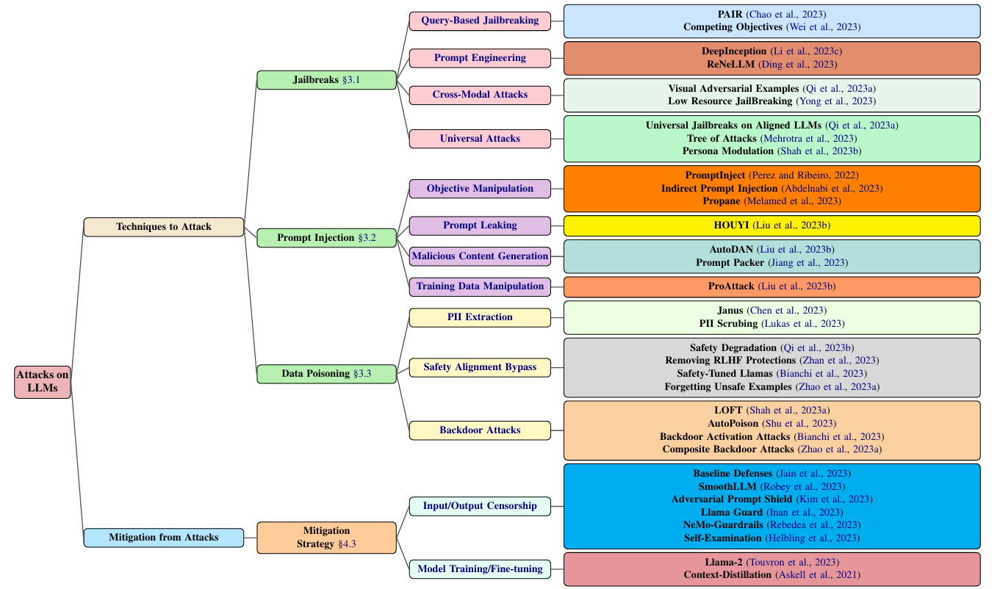

# 📄 A Comparative Survey of Attacks on Large Language Models

## 📝 Paper Information
- **Title:** A Comparative Survey of Attacks on Large Language Models  
- **Authors:** Arijit Ghosh Chowdhury, Md Mofijul Islam, Vaibhav Kumar, Faysal Hossain Shezan, Vinija Jain, Aman Chadha  
- **Affiliations:** University of Illinois Urbana-Champaign, Stanford University, Amazon GenAI, University of Texas at Arlington, UCLA, Georgia Institute of Technology  
- **Year of Publication:** 2024  
- **Conference/Journal:** Arxiv  
- **DOI/Link:** [arXiv:2403.04786](https://arxiv.org/abs/2403.04786)  

---

## 📌 Abstract Summary
This paper presents a **comprehensive survey** of **adversarial attacks** on **Large Language Models (LLMs)**, covering:
- **Jailbreak attacks:** Techniques that bypass content restrictions.
- **Prompt injection attacks:** Methods to manipulate LLM behavior.
- **Data poisoning attacks:** Techniques that corrupt training data.
- **Mitigation strategies:** A review of existing and emerging defense mechanisms.
The study categorizes attack methodologies, evaluates their effectiveness, and highlights the evolving nature of **LLM security risks**.

---

## 🎯 Research Objectives & Problem Statement
- **What problem does this paper address?**  
  The **increasing security threats** against LLMs and the **lack of standardized defenses**.
- **Why is this problem important?**  
  LLMs are being integrated into **critical applications**, making **security vulnerabilities highly impactful**.
- **What are the key research questions?**  
  1️⃣ What are the **most common attack vectors** against LLMs?  
  2️⃣ How do **white-box vs. black-box attacks** differ in their effectiveness?  
  3️⃣ What defense strategies exist, and how effective are they?

📌 *Key Excerpt from Paper:*  
> "The growing reliance on LLMs necessitates a deep understanding of adversarial threats to ensure their safe deployment."

---

## 🔬 Methodology
### **1️⃣ Taxonomy of LLM Attacks**
The paper introduces a **taxonomy** to categorize different types of attacks:
- **Jailbreak Attacks:** Exploit model vulnerabilities to bypass safety restrictions.
- **Prompt Injection Attacks:** Manipulate prompts to override system controls.
- **Data Poisoning Attacks:** Introduce malicious data into model training.

📌 *Key Taxonomy Figure:*  
  
🔍 **Figure Explanation:** This taxonomy visually represents the attack types and their relationships, showing how adversarial threats to LLMs are interconnected.

### **2️⃣ Attack Techniques & Case Studies**
- **Jailbreak Attacks:**
  - **PAIR (Prompt Automatic Iterative Refinement):** Uses an attacker LLM to optimize jailbreak queries.
  - **DeepInception Attack:** Embeds adversarial triggers in queries.
- **Prompt Injection Attacks:**
  - **HOUYI Attack:** Black-box attack framework for prompt manipulation.
  - **Propane:** Optimizes adversarial prompt structures.
- **Data Poisoning Attacks:**
  - **ProAttack:** High-efficiency poisoning strategy targeting training data.
  - **Janus:** Fine-tuning attack for leaking personally identifiable information (PII).

📌 *Key Attack Strategy Figure:*  
  
🔍 **Figure Explanation:** This figure outlines the steps involved in conducting **adversarial attacks**, highlighting the differences between white-box and black-box methodologies.

---

## 📊 Results & Findings
- **Jailbreak Attacks:**
  - **PAIR achieves a 99% jailbreak success rate on GPT-4**.
  - **Low-resource language attacks bypass filters** in multilingual LLMs.
- **Prompt Injection Attacks:**
  - **HOUYI achieves 86.1% success rate** across real-world applications.
  - **Indirect prompt injections remain undetectable in API-based models**.
- **Data Poisoning Attacks:**
  - **Janus enables GPT-3.5 to leak PII at 70% success rate**.
  - **ProAttack evades traditional fine-tuning defenses**.

📌 *Key Results Figure:*  
  
🔍 **Figure Explanation:** Demonstrates the **effectiveness of different attacks** against major LLMs, emphasizing security weaknesses in commercial models.

📌 *Key Excerpt from Paper:*  
> "Attack methodologies are rapidly evolving, with novel prompt injection techniques now achieving near 100% bypass rates."

---

## 📢 Discussion & Analysis
### **1️⃣ Strengths**
✅ Comprehensive taxonomy of **LLM attack strategies**.  
✅ Empirical **evaluation of attack success rates** on **multiple models**.  
✅ Explores **real-world implications** of adversarial vulnerabilities.  

### **2️⃣ Weaknesses**
⚠️ **No new defensive techniques proposed**—focus is on attack methods.  
⚠️ **Limited analysis of closed-source models** (ChatGPT, Bard).  
⚠️ **Overlooks ethical considerations** in adversarial AI testing.

---

## 📚 Related Work
- **Adversarial Attacks in NLP:** FGSM, PGD, and adversarial prompt engineering.
- **Backdoor Attacks on LLMs:** Data poisoning risks in fine-tuned models.
- **LLM Defense Strategies:** Guardrails, adversarial training, and red-teaming.

📌 *Key Comparative Figure:*  
  
🔍 **Figure Explanation:** Highlights the **arms race** between adversarial attacks and evolving LLM defenses.

---

## 🏆 Relevance to Our Project
| Criterion | Score (1-5) | Notes |
|-----------|------------|-------|
| **Relevance to AI Security/Agents** | 5 | Directly relates to **LLM security research**. |
| **Methodology aligns with our project?** | 5 | Provides insights into **MiniSpec prompt security testing**. |
| **Potential for real-world application?** | 5 | Demonstrates practical **LLM vulnerabilities**. |
| **Availability of dataset/code?** | 4 | No dataset, but **code is partially available**. |
| **Overall usefulness for our research?** | 5 | Essential reference for **adversarial AI testing**. |

📢 **Final Verdict:** ✅ **Highly Relevant**

---

## ✍️ Personal Takeaways
- **LLM security remains an ongoing challenge**, with adversaries continuously refining attack techniques.
- **Prompt injection and data poisoning attacks are highly effective** and require **new mitigation strategies**.
- **This paper reinforces the need for robust LLM security evaluations** before production deployment.

📌 *Final Thoughts:*  
> "This survey provides a critical foundation for advancing adversarial research in AI security."

---

## 🛠️ Actionable Next Steps
🔹 **Should we cite this paper in our research?** ✅ YES  
🔹 **Should we explore its methodology further?** ✅ YES  
🔹 **Should we replicate its experiments?** ✅ YES (For LLM security benchmarking)  
🔹 **Potential researchers to contact for collaboration:** [Paper authors]

---
