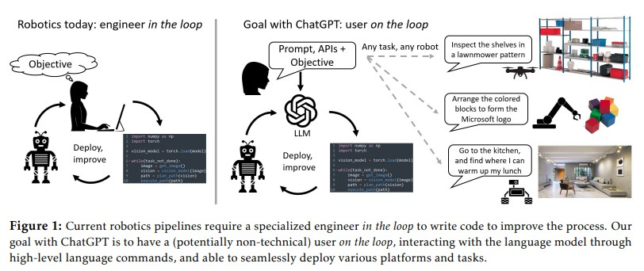

# 📑 Research Paper Review

## 1️⃣ Paper Metadata
- **📌 Title:** ChatGPT for Robotics: Design Principles and Model Abilities  
- **🖊️ Authors:** Sai Vemprala*, Rogerio Bonatti*, Arthur Bucker, Ashish Kapoor (*Equal contribution)  
- **📅 Year & Venue:** 2023, Microsoft Research (Preprint, Technical Report)  
- **🔗 Link:** [https://aka.ms/ChatGPT-Robotics](https://aka.ms/ChatGPT-Robotics)  
- **🔗 GitHub (PromptCraft):** [https://github.com/microsoft/PromptCraft-Robotics](https://github.com/microsoft/PromptCraft-Robotics)

---

## 2️⃣ Abstract Summary (🔎 Quick Insight)

This paper explores the adaptation of ChatGPT for use in robotics by combining high-level API abstractions with prompt engineering techniques. It presents a framework where natural language inputs are translated into robot-executable code, validated in both simulated and real-world environments. The work emphasizes the potential of ChatGPT for zero-shot planning, manipulation, and navigation tasks, introducing **PromptCraft**, an open-source toolkit for prompt sharing and simulation. The study demonstrates that LLMs can extend their natural language reasoning into real-world robotics when paired with structured APIs and human oversight.

---

## 3️⃣ Research Context & Motivation (🧐 Why It Matters)

- **🔍 What problem does the paper address?**  
  Bridging the gap between natural language models and robotic control systems. Specifically, enabling non-expert users to control robots through dialogue without writing low-level code.

- **📊 Why is this problem important?**  
  Most robotic systems require specialized programming knowledge, limiting accessibility and adaptability. A natural-language interface could democratize robotics and accelerate deployment.

- **📚 How does it connect to existing work?**  
  Builds upon zero-shot planning work (e.g., SayCan, Code-as-Policies), language-based robotic interaction, and vision-language models, but stands out through its **dialog-based correction**, multi-domain scope, and emphasis on **open-loop vs closed-loop reasoning**.

---

## 4️⃣ Key Contributions (🚀 What’s New & Valuable?)

- ✅ **Proposed a generalizable framework** for integrating ChatGPT into robotics pipelines using prompt engineering + high-level APIs.
- ✅ Demonstrated **zero-shot capabilities** for diverse tasks: manipulation, navigation, perception-action loops.
- ✅ Introduced **PromptCraft**, a collaborative, open-source platform for prompt engineering in robotics.
- ✅ Supported by **simulated (AirSim, Habitat)** and **real-world** experiments (e.g., Tello drone).
- ✅ Showcased novel use of structured formats like **XML-tagged outputs** for post-processing and control.

---

## 5️⃣ Methodology (🛠️ How Did They Do It?)

- **📝 Approach & Model:**  
  Utilizes ChatGPT (based on GPT-3.5) as a controller by feeding it prompts structured with:
  - Natural language task description
  - A list of predefined API functions
  - Environmental context (e.g., object types, current robot state)
  - Constraints and examples  
  ChatGPT parses intent → emits high-level function calls → validated via simulation or human.

- **🧪 Experimental Setup:**  
  Domains tested:  
  - Visual servoing (catching a ball)  
  - Drone navigation (real & AirSim)  
  - Block manipulation with curriculum learning  
  - Embodied agents (Habitat-based closed-loop navigation)  
  Evaluation: qualitative demos and response correctness.

- **⚙️ Implementation Details:**  
  - APIs abstract away platform-specific details (e.g., `go_to_location("fridge")`)
  - Code can link to ROS, AirSim, or real platforms
  - ChatGPT used without fine-tuning; relies on prompt engineering only
  - XML-tagging and multi-turn dialog leveraged for better control flow

---

## 6️⃣ Results & Analysis (📊 What Did They Find?)

### 📈 Key Findings:

- ChatGPT can generate meaningful control logic with **zero-shot prompting** when provided with well-defined APIs.
- **Dialog-based corrections** significantly improve outputs compared to static prompts.
- Effective use of **SVG generation** and **reasoning chains** shows implicit "world modeling" capabilities.

### 📊 Tables & Figures:
- **Figure 2:** Robotics pipeline using ChatGPT and human-in-the-loop validation.
- **Figure 4-5:** Example of code evolution with prompt improvement and XML tagging.

### 📉 Limitations noted:
- ChatGPT may hallucinate API parameters if prompts are under-specified.
- Fails without clear task descriptions or guidance on function use.
- No quantitative benchmarks; evaluation is scenario-based and qualitative.

---

## 7️⃣ Critical Evaluation (🧐 Strengths & Weaknesses)

### 🟢 Strengths

- ✅ **Accessible robotics control** via natural language.
- ✅ **Flexible dialog-based correction** → supports user feedback in real time.
- ✅ Generalizable to **multiple platforms** (simulated & physical).
- ✅ Promotes **community collaboration** via PromptCraft.
- ✅ Effective use of **prompt constraints**, **task decomposition**, and **structured outputs**.

### 🔴 Weaknesses

- ❌ Lacks **quantitative evaluation** (no standard benchmarks or error rates).
- ❌ Heavy reliance on **manual prompt tuning** – not scalable for complex applications.
- ❌ **No integration with RL**, learning from failure, or self-improvement.
- ❌ Safety-critical systems (e.g., drones, industrial robots) still need **strict supervision**.

---

## 8️⃣ Real-World Applications (🌎 Impact & Use Cases)

- **🏢 Industrial Use**: Interactive inspection, automation scripting for drones, robotic arms.
- **🤖 Real-World AI/ML**: Language-driven robotic planning for home assistants, delivery robots, or warehouse navigation.
- **⚡ Future Research**:
  - Prompt optimization via RL or CoT feedback
  - Secure deployment in safety-critical systems
  - Integration with **multi-modal** perception for real-time reasoning

---

## 9️⃣ Personal Takeaways & Ideas (💡 What Can You Do With This?)

- This paper aligns closely with my interest in **controlling PX4 Autopilot Systems** via LLMs.
- It inspires a project idea: building a **PX4-WebUI layer**, where human instructions are translated into MAVSDK or MAVROS commands using a GPT interface.
- Could adapt the PromptCraft ideas to PX4 commands (e.g., `arm()`, `takeoff()`, `goto(x,y,z)`) and test in **Gazebo or HITL**.
- Integration with **YOLO object detection + scene description → prompt → PX4 command** loop sounds feasible and powerful.

---

## 🤖 Is It Useful for PX4 Autopilot System? (Custom Critique)

**Yes — with caveats.**

### ✅ How It Helps:
- The proposed framework could serve as a **natural-language command interface** for PX4.
- You can define a **custom high-level function library** (e.g., `navigate_to_gps(lat, lon)`, `circle_object(name)`) mapped to MAVSDK/MAVROS services.
- PromptCraft’s approach enables easier testing in **Gazebo-PX4** setups with AirSim-like environments.

### ⚠️ Caution:
- PX4 is **real-time and safety-critical** — ChatGPT’s hallucinations and lack of hard guarantees make full autonomy risky.
- Must use **human-in-the-loop validation** (as the paper suggests) + constraints in prompt structure.
- A better fit may be **closed-loop planning assistant** rather than direct autonomous agent.

---

## 🔗 References & Further Reading

- [PromptCraft GitHub](https://github.com/microsoft/PromptCraft-Robotics)
- SayCan (Google, 2022): grounding LLMs in robotic affordances
- Code-as-Policies (2022): LLM-generated Python for robotic control
- Inner Monologue (Google, 2022): dialog-based embodied planning
- PX4 Autopilot: https://docs.px4.io

---

## 🎯 Overall Rating (⭐️ Research Impact Score)

| Category               | Score (1–5 ⭐) |
|------------------------|---------------|
| Novelty               | ⭐⭐⭐⭐✰        |
| Technical Rigor       | ⭐⭐⭐⭐✰        |
| Clarity & Presentation| ⭐⭐⭐⭐⭐        |
| Practical Usefulness  | ⭐⭐⭐⭐✰        |

---

> 💡 *Use this framework to bridge the gap between LLMs and PX4 drones by building structured prompts + function libraries, and always test in simulation first!*

