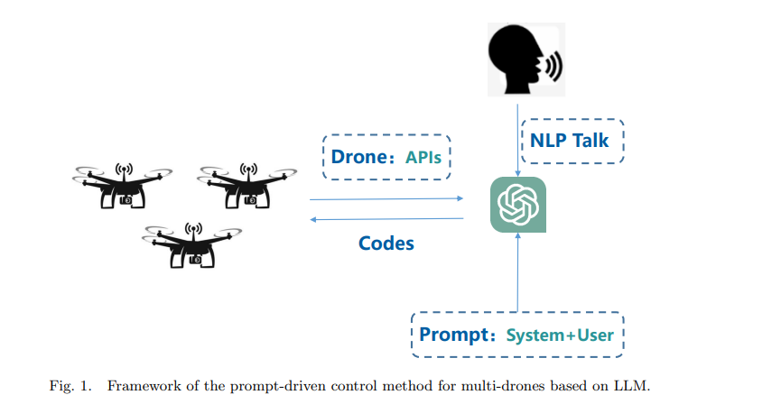
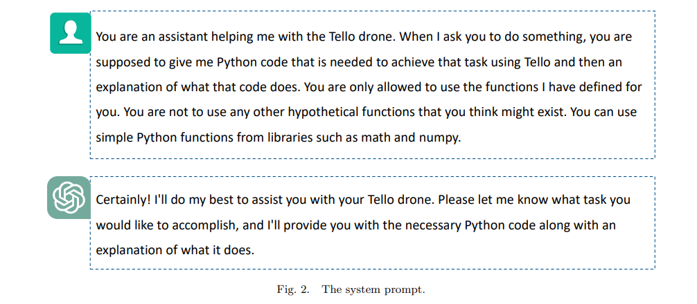
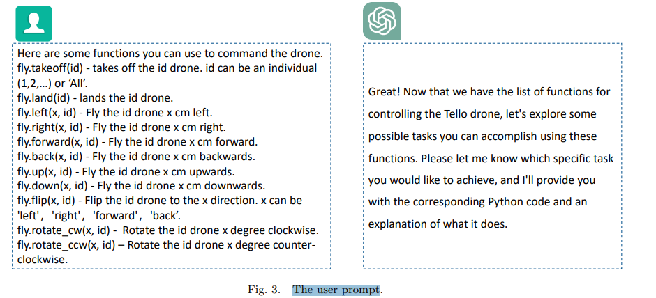
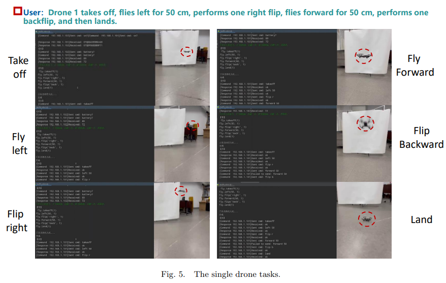

# 📑 Research Paper Review

## 1️⃣ Paper Metadata
- **📌 Title:** A Prompt-driven Task Planning Method for Multi-drones based on Large Language Model  
- **🖊️ Author:** Yaohua Liu  
- **📅 Year & Venue:** 2024, *Unmanned Systems*, World Scientific Publishing  
- **🔗 DOI/Link:** [YouTube Demo](https://www.youtube.com/watch?v=yU1iviLBH24)

---

## 2️⃣ Abstract Summary (🔎 Quick Insight)

This paper introduces a novel prompt-driven control framework using Large Language Models (LLMs) to manage multi-drone systems. It enables users to issue natural language commands, which are interpreted by LLMs to generate executable drone code in real-time. The method simplifies interaction, supports zero-shot task planning, and is validated across single-drone, synchronized, and asynchronous multi-drone scenarios using Tello drones.

---

## 3️⃣ Research Context & Motivation (🧐 Why It Matters)

- **🔍 Problem Addressed:**  
  Traditional multi-drone task planning systems require pre-defined control logic and lack adaptability in dynamic environments. Complex interactions, path planning, and coordination still pose major challenges.

- **📊 Importance:**  
  Simplifying drone control through natural language increases accessibility, reduces reliance on ground control stations, and enables rapid deployment in real-time scenarios.

- **📚 Related Work:**  
  Extends previous efforts in LLMs for robotic arms and language-conditioned control (e.g., Code-as-Policies, SayCan) to the drone domain—particularly underexplored for multi-drone orchestration.

---
## Figures

## 4️⃣ Key Contributions (🚀 What’s New & Valuable?)

✅ Introduces a **prompt-driven method** using LLMs to control multi-drone systems.  
✅ Combines **system prompts**, **user prompts**, and a **motion function library** for safe and structured drone code generation.  
✅ Demonstrates zero-shot control capability through **voice-based interaction** and **real-time coordination**.  
✅ Verifies both **synchronous** and **asynchronous** multi-drone tasks using low-cost Tello drones.

---

## 5️⃣ Methodology (🛠️ How Did They Do It?)

- **📝 Approach & Model:**  
  - Uses a custom prompt template combining:
    - **System prompts**: constraints on LLM behavior and available functions.
    - **User prompts**: high-level commands in natural language.
  - A **function library** (e.g., `fly.takeoff(id)`, `fly.left(x, id)`) restricts generation scope.

- **🧪 Experimental Setup:**  
  - Tested on Tello drones using a LAN setup.
  - GUI-based voice control interface.
  - Experiments: single drone tasks, synchronized drone pair, and temporal sequencing (asynchronous tasks).

- **⚙️ Implementation Details:**  
  - Python interface with UDP commands sent to drones.
  - Real-time speech-to-text → prompt → LLM → Python code → drone execution.

---

## 6️⃣ Results & Analysis (📊 What Did They Find?)

### 📈 Key Findings:
- LLMs accurately converted natural language instructions into drone control code.
- Multi-drone systems successfully completed coordinated tasks, even with temporal dependencies.
- Demonstrated real-time adaptability through live voice input.

### 📊 Visual Highlights:
- **Fig. 4–7:** Illustrate GUI interface, synchronous and asynchronous control flows with clear visualization of drone behavior.

### 📉 Limitations Noted:
- Not explicitly benchmarked against baseline systems (e.g., centralized planners, swarm algorithms).
- Scalability to large drone fleets or outdoor environments is not discussed.

---

## 7️⃣ Critical Evaluation (🧐 Strengths & Weaknesses)

### 🟢 Strengths
- ✅ Excellent real-time interaction via natural language and voice interface.
- ✅ Modular and extensible function-based control.
- ✅ Validated in both synchronous and asynchronous task settings.
- ✅ Supports zero-shot generalization without fine-tuning.

### 🔴 Weaknesses
- ❌ Limited to small-scale LAN-based drone setups.
- ❌ No quantitative evaluation or comparisons with standard benchmarks.
- ❌ Error handling and safety constraints are only lightly discussed.
- ❌ Scalability to swarm-level drone control or outdoor GPS-based navigation untested.

---

## 8️⃣ Real-World Applications (🌎 Impact & Use Cases)

- **🏢 Industrial Applications:**  
  Warehouse inventory drones, infrastructure inspection with voice-commanded mission plans.

- **🤖 AI Deployment:**  
  Rapid prototyping of drone behaviors using LLMs in simulation or classroom environments.

- **⚡ Future Directions:**  
  - Expand to outdoor drones with GPS navigation.
  - Incorporate feedback loops from drone sensors for reactive planning.
  - Scale up to 5+ drone fleets in coordinated missions.

---

## 9️⃣ Personal Takeaways & Ideas (💡 What Can You Do With This?)

- **Relation to My Research:**  
  The method is highly relevant for natural-language PX4 control via MAVSDK or MAVROS integration.

- **Future Ideas:**  
  - Implement a similar prompt + function library pipeline for PX4 drones using QGC or ROS2.
  - Extend the language control interface to manage dynamic mission reallocation during flight.
  - Apply multi-modal feedback (vision, telemetry) as context for adaptive prompt generation.

---

## 🤖 Is This Useful for PX4 Autopilot System?

### ✅ **YES – With Key Adaptations**

- The paper shows that prompt-driven LLMs can **translate high-level instructions into executable code**, a concept that maps well to **PX4 MAVSDK APIs** (e.g., `arm()`, `takeoff()`, `goto_location()`).
- The **function library approach** constrains LLM output, which enhances **safety**—crucial for PX4 systems.
- It enables **voice or text control layers** on top of PX4 without rewriting firmware or flight control logic.

### ⚠️ Considerations:
- PX4 missions often use **GPS coordinates, flight plans, and real-time sensor data**—this was not addressed in the Tello-based setup.
- PX4 is **more complex and safety-critical**, so prompts must be validated, and execution monitored with fail-safes.
- Code should interface with **MAVROS, MAVSDK, or QGroundControl APIs**, not just toy drone UDP protocols.

### 🔄 Suggested Adaptation:
1. Build a **PX4 motion function library** (takeoff, move_to, land, RTL).
2. Use the same LLM prompting scheme to generate ROS Python scripts.
3. Add telemetry feedback loop to LLM for closed-loop corrections.

---

## 🔗 References & Further Reading
- **📖 Related Work:**
  - Code-as-Policies (ICRA 2023)
  - ProgPrompt (ICRA 2023)
  - SayTap (LLM→Locomotion)
- **📝 Demos:**
  - [YouTube Test Video](https://www.youtube.com/watch?v=yU1iviLBH24)

---

## 🎯 Overall Rating (⭐️ Research Impact Score)

| Category               | Score (1–5 ⭐) |
|------------------------|---------------|
| Novelty               | ⭐⭐⭐⭐✰        |
| Technical Rigor       | ⭐⭐⭐⭐          |
| Clarity & Presentation| ⭐⭐⭐⭐⭐         |
| Practical Usefulness  | ⭐⭐⭐⭐✰        |

---

> 💬 *This work is a promising blueprint for building natural-language control interfaces for PX4 drones using LLMs and prompt templates. Carefully adapting this method to robust autopilot systems could unlock safer, scalable, and more intuitive drone deployments.*
