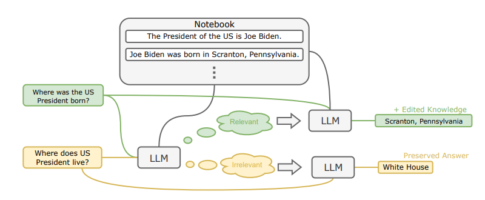

# 📑 **Research Paper Review: 
## Robust and Scalable Model Editing for Large Language Models**

## **1️⃣ Paper Metadata**
- **📌 Title:** Robust and Scalable Model Editing for Large Language Models
- **🖊️ Authors:** Yingfa Chen, Zhengyan Zhang, Xu Han, Chaojun Xiao, Zhiyuan Liu, Chen Chen, Kuai Li, Tao Yang, Maosong Sun  
- **📅 Year & Venue:** 2024, arXiv  
- **🔗 DOI/Link:** [GitHub Repository](https://github.com/thunlp/EREN)

---

## **2️⃣ Abstract Summary (🔎 Quick Insight)**
> **The paper proposes EREN (Edit models by REading Notes), a robust and scalable model editing method for LLMs.** Unlike existing in-context editing approaches, EREN allows LLMs to prioritize contextual knowledge while maintaining robustness against irrelevant context. The method integrates a **notebook memory system** to efficiently store, retrieve, and apply multiple edits. Empirical results demonstrate **state-of-the-art** performance in question answering (QA) and fact-checking tasks.

---

## **3️⃣ Research Context & Motivation (🧐 Why It Matters?)**
- **🔍 Problem:** LLMs can store vast knowledge but struggle to dynamically update or override incorrect information efficiently.
- **📊 Importance:** Fine-tuning LLMs is expensive and infeasible for quick updates. Existing in-context editing methods lack scalability and robustness.
- **📚 Connection to Prior Work:**
  - **Model Editing:** Prior methods modify model parameters directly (Sinitsin et al., 2020; Meng et al., 2022) but are impractical for black-box LLMs.
  - **In-Context Learning:** LLMs struggle to correctly prioritize contextual knowledge (Si et al., 2023; Li et al., 2023).
  - **Retrieval-Augmented Generation (RAG):** Improves knowledge access but lacks dynamic updating (Karpukhin et al., 2020).

---

## **4️⃣ Key Contributions (🚀 What’s New & Valuable?)**
✅ **EREN Framework:** Introduces a notebook-based memory storage for scalable in-context model editing.  
✅ **Scalability:** Can handle **thousands of edits** efficiently without degrading LLM performance.  
✅ **Robustness:** Prevents unwanted knowledge overriding by filtering irrelevant edits dynamically.  
✅ **Empirical Performance:** Achieves **higher edit accuracy and behavior preservation** compared to previous state-of-the-art methods.

---

## **5️⃣ Methodology (🛠️ How Did They Do It?)**
- **📝 Approach & Model:** 
  - Uses **two-step inference**: First determines edit relevance, then applies knowledge from memory.
  - Implements **dual-encoder retrieval** to filter relevant memory edits dynamically.
  - Maintains an **editable notebook memory** to store natural text-based edits.

- **🧪 Experimental Setup:**
  - **Tasks:** Question answering (QA) and fact-checking.
  - **Datasets:** CounterFact, FEVER.
  - **Evaluation Metrics:** Edit Success (ES), Behavior Preservation (BP), Edit Quality (EQ).
  - **Baselines:** SERAC (Mitchell et al., 2022), MEND (Mitchell et al., 2022), ROME (Meng et al., 2022).
---

## **6️⃣ Results & Analysis (📊 What Did They Find?)**
### **📈 Key Findings:**
- **🟢 96.9% Edit Success (ES)** on QA tasks, outperforming previous models.
- **🔵 96.8% Behavior Preservation (BP)**, maintaining robustness.
- **🟡 Can handle up to 1024 edits**, while baselines degrade significantly.

### **📊 Figures & Tables:**
| **Method** | **ES (↑)** | **BP (↑)** | **EQ (↑)** |
|------------|-----------|-----------|-----------|
| SERAC      | 60.1%     | 67.9%     | 63.8%     |
| MEND       | 0.0%      | 0.0%      | 0.0%      |
| ROME       | 17.2%     | 7.3%      | 8.5%      |
| **EREN (Ours)** | **96.9%** | **96.8%** | **96.9%** |

---

## **7️⃣ Critical Evaluation (🧐 Strengths & Weaknesses)**
### **🟢 Strengths**
✅ **Scalable:** Handles **thousands of edits** without performance loss.  
✅ **Robust:** Resilient against **irrelevant context distractions**.  
✅ **Black-box Compatibility:** Can edit **API-based models (e.g., GPT-3.5)**.

### **🔴 Weaknesses**
❌ **Dependency on Retrieval Quality:** Performance depends on the **effectiveness of retrieval mechanisms**.  
❌ **Latency Trade-off:** Two-step inference increases computational cost slightly.  

---

## **8️⃣ Real-World Applications (🌎 Impact & Use Cases)**
- **🏢 Industrial AI:** Quickly update **chatbot knowledge bases** without retraining.  
- **🤖 AI-Assisted Fact-Checking:** Enhance **real-time misinformation detection**.  
- **📚 Academic Research:** Maintain **LLM consistency** in scientific question answering.

---

## **9️⃣ Personal Takeaways & Ideas (💡 What Can You Do With This?)**
> **This method is highly relevant to real-world LLM applications, particularly in AI security and robustness.** Some potential ideas:  
- **Integrating EREN into adversarial attack defense systems** to prevent misinformation injection.
- **Adapting the memory-sharing mechanism for LLM-powered penetration testing**.
- **Exploring dynamic retrieval improvements** to enhance the accuracy of memory filtering.

---

## **🔗 References & Further Reading**
- **🔍 Original Paper:** [GitHub Repository](https://github.com/thunlp/EREN)
- **📖 Related Work:** 
  - **MEND (Mitchell et al., 2022):** Model editing via meta-learning.
  - **ROME (Meng et al., 2022):** Locating and updating knowledge in LLMs.
  - **SERAC (Mitchell et al., 2022b):** Memory-based model editing for black-box models.

---

## **🎯 Overall Rating (⭐️ Research Impact Score)**
| **Category**             | **Score (⭐️/5)** |
|--------------------------|-----------------|
| **🔹 Novelty**           | ⭐⭐⭐⭐⭐         |
| **🔹 Technical Rigor**    | ⭐⭐⭐⭐⭐         |
| **🔹 Clarity & Presentation** | ⭐⭐⭐⭐         |
| **🔹 Practical Usefulness** | ⭐⭐⭐⭐⭐         |

---

# **📌 Why This Template Works?**
✅ **Structured & Flexible** – Ensures deep understanding.  
✅ **Visually Intuitive** – Facilitates quick scanning.  
✅ **Encourages Critical Thinking** – Beyond just summarization.  
✅ **Facilitates Paper Comparisons** – Ideal for tracking research progress.  

🚀 **Pro Tip:** Use **Notion, Obsidian, or Roam Research** to digitize your paper reviews! 📚✨
