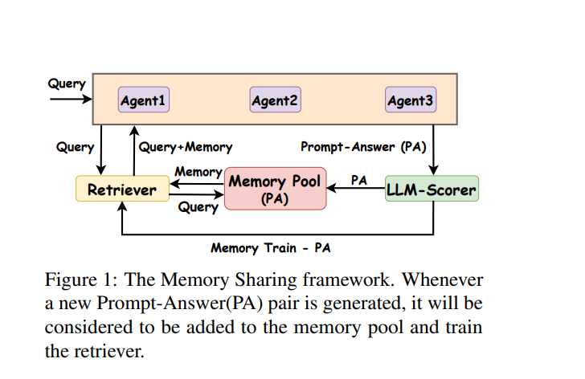

# **Adaptive Attacks Break Defenses Against Indirect Prompt Injection**

### ✅ **Title:**
**Adaptive Attacks Break Defenses Against Indirect Prompt Injection Attacks on LLM Agents**

### ✅ **Abstract:**
LLM agents leverage external tools to interact with environments, but this exposes them to **Indirect Prompt Injection (IPI) attacks**. While several defenses have been proposed to counteract these attacks, their **robustness is questionable against adaptive attacks**. This study evaluates eight defenses and systematically **bypasses all of them** using adaptive attack strategies, demonstrating a **success rate exceeding 50%**. The findings highlight the **need for rigorous adaptive attack testing** to ensure the reliability of defenses in real-world deployments.

### ✅ **Conclusion:**
- **All tested defenses fail against adaptive attacks.**
- **Adaptive attacks remain highly effective (success rates > 50%)** even against advanced defenses.
- **Future defenses should incorporate adaptive attack considerations to improve resilience.**

---

## **📌 Step 2: Read the Key Sections in Detail**

### 🔹 **Introduction – Why is this research necessary?**
- **LLM agents** use external tools, increasing their attack surface.
- **Indirect Prompt Injection (IPI) attacks** manipulate external data sources to control LLM behavior.
- **Existing defenses (e.g., fine-tuned detectors, input isolation, adversarial training) fail against adaptive attacks.**
- **This research evaluates IPI defenses under adaptive attacks to expose vulnerabilities.**

---

### 🔹 **Methodology – How was this done?**

#### **1️⃣ Defense Strategies Evaluated**
1. **Detection-Based**
   - Fine-tuned detectors
   - LLM-based classifiers
   - Perplexity filtering
2. **Input-Level Protections**
   - Instructional prevention
   - Data prompt isolation
   - Sandwich prevention
   - Paraphrasing adversarial prompts
3. **Model-Level Protections**
   - Adversarial fine-tuning

#### **2️⃣ Adaptive Attack Techniques**
- **Greedy Coordinate Gradient (GCG):** Generates adversarial strings that exploit weaknesses in LLM decision-making.
- **Multi-objective GCG (M-GCG):** Optimizes for both adversarial success and detection avoidance.
- **Two-stage GCG (T-GCG):** Designed to break paraphrasing defenses.
- **AutoDAN:** Generates stealthy, high-perplexity adversarial strings.

---

### 🔹 **Results & Discussion – Key Findings**
#### **1️⃣ Defense Performance Under Adaptive Attacks**
- **All defenses were bypassed, with adaptive attack success rates exceeding 50%.**
- **Fine-tuned detectors performed best but still failed under advanced attacks.**
- **Paraphrasing and perplexity filtering provided limited resistance but were circumvented.**

#### **2️⃣ Attack Impact Analysis**
- **LLM agents trained with adversarial fine-tuning exhibited slightly better resistance.**
- **Adaptive attacks significantly lowered detection rates of defenses.**
- **Paraphrasing and sandwich prevention introduced noise but did not stop attacks.**

---

## **📌 Research Significance**
### **🔍 What problem does this paper solve?**
- **Existing defenses fail against real-world adversarial threats.**
- **This study highlights the critical need for adaptive attack resilience.**

### **🔍 Main Contribution:**
✅ **Comprehensive evaluation of IPI defenses under adaptive attack settings.**  
✅ **Demonstrates weaknesses in existing security measures for LLM agents.**  
✅ **Provides insights into improving defenses against evolving threats.**  

### **🔍 How does this paper fit into Cybersecurity & AI research?**
- **Penetration testing for AI models.**
- **AI adversarial security analysis.**
- **Improving LLM defenses in high-risk applications.**

---

## **📌 Next Steps & Future Work**
- **Developing defenses resilient to adaptive attacks.**
- **Investigating real-world applications where IPI attacks could cause significant damage.**
- **Enhancing adversarial fine-tuning approaches for robustness.**

---

## **🔎 Key Takeaways**
💡 **Adaptive attacks remain a critical vulnerability in LLM security.**  
💡 **Existing defenses are insufficient against real-world adversarial threats.**  
💡 **Future security research must prioritize adaptive attack testing.**  

This research is essential for **AI security teams**, **LLM developers**, and **cyber threat analysts** working to **enhance AI robustness** against adversarial manipulations. 🚀
